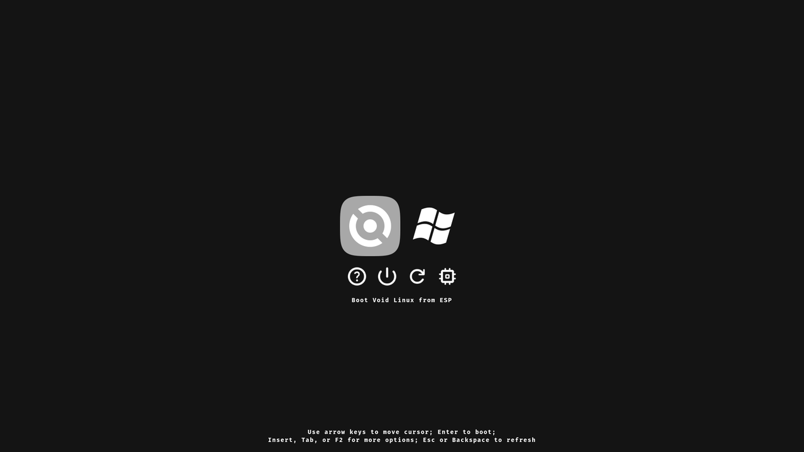

# rEFInd theme
Clean, easy-to-use, grayscale dualboot theme for the [refind](https://www.rodsbooks.com/refind) boot manager.

## How to use
You have to copy `refind.conf` and the `assets` folder right next to your refind executable. It is going to be different on every PC setup so you have to figure out for your case. Then you have to modify the configuration file according to your own setup, mainly in the menuentry sections.